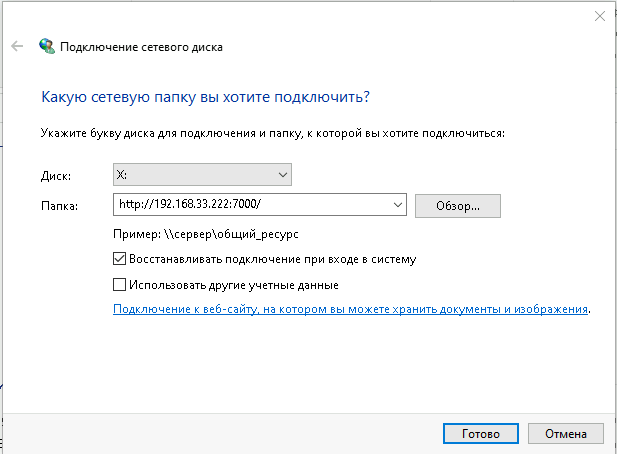

Выполнять в следующей последовательности:

Все настройки окружения произведены со страницы *https://dev.1c-bitrix.ru/learning/course/index.php?COURSE_ID=32&CHAPTER_ID=020916&LESSON_PATH=3903.4862.20866.20916*

Файлы конфигурации взяты отсюда *https://dev.1c-bitrix.ru/docs/chm_files/redhat8.zip*

Проект поддерживает весрии php 7.3 - 8.1, для этого в файле .env изменяем перменную PHP_VERSION и выполняем 

   `docker-compose up -d --build web`

- phpmyadmin доступен на 33333 порту

- также можно сменить версию mysql в файле .env, после этого выполнить

`docker-compose up -d --build mysql`

Переход на версию mysql желательно осуществлять через бэкап-восстановление

1. **Чтобы** был доступ на редактирование файлов в проекте и на хосте и в контейнере:
   
   выполним на своей системе 
   
   *`id -u`* - USER_ID
   *`id -g`* - USER_GID
   

   свой результат вставим в переменную в файл .env
            
   
   **При ошибке установки пакетов необходимо выполнить**
   https://sylabs.io/guides/3.8/admin-guide/user_namespace.html#user-namespace-requirements

Debian   

```bash
sudo sh -c 'echo kernel.unprivileged_userns_clone=1 \
    >/etc/sysctl.d/90-unprivileged_userns.conf'
sudo sysctl -p /etc/sysctl.d /etc/sysctl.d/90-unprivileged_userns.conf
```

   RHEL/CentOS 7

From 7.4, kernel support is included but must be enabled with:


```bash
sudo sh -c 'echo user.max_user_namespaces=15000 \
    >/etc/sysctl.d/90-max_net_namespaces.conf'
sudo sysctl -p /etc/sysctl.d /etc/sysctl.d/90-max_net_namespaces.conf
```


2. deleted
3. ***`mkdir -m 777 -p ./volumes/mysql`***
    
   ***`mkdir -m 777 -p ./volumes/www`***

4. ***`docker-compose up -d --build`***
5.  **копируем** bitrixsetup.php или restore.php в папку ./volumes/www
    
      **`chmod -R 777 ./volumes/www`**

      **`chmod -R 777 ./volumes/mysql`**
      
      **`chmod -R 777 ./services/push/logs`**

      **`chmod -R 777 ./services/web/logs`**

      Данные для подключения к БД пописаны в .env

      
6. Вэб доступен по http://IP:BITRIX_PORT 
   
   

7. в файле .settings.php в проекте прописываем данные для соединения с БД и вставляем ключ: 

      ***'signature_key' => 'bVQdNsrRsulOnj9lkI0sPim292jMtrnji0zzEl5MzCBeHT7w1E5HL3aihFb6aiFJfNEIDxmcFrowS3PTLZFDxAfuNNuCN5EcFRaveaUaRZHSThtWKV7Vp5vGbz9kb3cN'***

      ***'path_to_publish' => 'http://nginx:8895/bitrix/pub/'***

      пример .settings.php в папке services/bitrix-set/
      
      **или кидаем services/bitrix-set/.settings_extra.php в www/bitrix**

      **Если push&pull не работает, необходимо пересохранить настройки в модуле push&pull выбрав 2 пункт  и потом 4-й**
      **для прохождения теста с сокетами в /etc/hosts прописать**

      **`<IP сетевой карты> <домен>`**

      **либо использовать сайт по внешнему адресу сетевой карты**

     **далее заходить по домену**

8. **Для доступа по FTP используется порт из .env** (https://github.com/delfer/docker-alpine-ftp-server)
   
   FTP использует волум без проброса
   
   запуск проекта с FTP:

   `docker-compose -f docker-compose.yml -f ftp.yml up -d --build`

   пользователь по умолчаю прописан в ftp.yml:

   bitrix
   123456
   папка /ftp

   подлючение активное

9. **Добавил webdav сервер**. По умолчанию доступен на порту 7000, логин bitrix, пароль 123456
   
   Работает на windows 10
   
   Запуск проекта с WEBDAV:

   `docker-compose -f docker-compose.yml -f webdav.yml up -d --build`

   пользователь по умолчаю прописан в webdav.yml

   Подключаем диск (указываем логин и пароль)
   
   *http://host:port/*

   


**Дополнительно**:
- в файле .env содержатся данные для подключения к mysql,
  логин и пароль пользователя bitrix из env используем только при чистой установке битрикс
- в папках **services/web/httpd, services/web/nginx, services/web/php** содержатся файлы для кастомных настроек
- services/bitrix-set
- логи apache, nginx и cron в папке **services/<сервис>/logs**
- адрес сервера БД - **mysql** (указываем для подключения)

- ***`docker-compose up -d --build`***  - запуск только первый раз или при изменении конфигов сервисов, далее уже запускаем *docker-compose up -d* или ***`docker-compose start`*** (вэбка доступна по порту 80 или 443, mysql - 3306)
- ***`docker exec -ti <сервис> /bin/bash`*** - подключиться к контенеру в баш )
- 
Setting boundaries for WSL2
We need to set some reasonable resource constraints on what WSL2 can actually use. Fortunately, that’s as simple as going to c:\users\*your your profile name* and creating a .wslconfig file. On my setup, a MSI Prestige 15 with a 10710u 6-core processor and 16GB of RAM, mine looks like this:

```
[wsl2]
memory=4GB # Limits VM memory in WSL 2 to 4 GB
processors=5 # Makes the WSL 2 VM use two virtual processors
```

